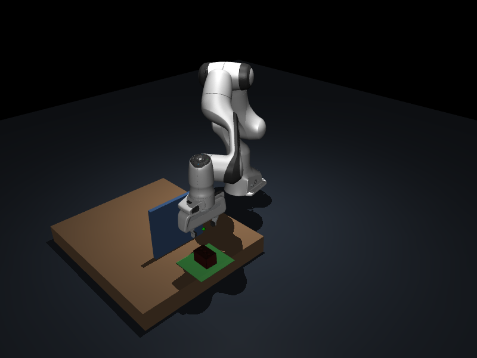

# EE5110 Segment C：自主机器人抓取 baseline

[GitHub 项目](https://github.com/m13961023616-pixel/EE5110-SegC) · [持续集成](https://github.com/m13961023616-pixel/EE5110-SegC/actions/workflows/baseline.yml)

## v1.3.0：障碍物可靠性改进

`challenge_main.py` 默认使用新的 `robust` 方法。原普通 baseline 入口仍是 `main.py`。
针对“末端 IK 收敛但前臂/手腕碰挡板”增加静态碰撞过滤和最多九个局部 IK 种子；
双指夹爪增加180°等价朝向候选，保留原抓取点和接近轴。
保留净空通道并增加两侧备用通道；放置点优先向桌面内侧偏移25 mm，仍处于原55 mm目标容差内。
场景、物体尺度/质量、摩擦、力上限、IK精度、RRT迭代上限和物理成功判据均未放宽。

```powershell
# GUI / PyCharm：重放已恢复的28 cm前臂碰撞场景
.\.venv\Scripts\python.exe challenge_main.py --height .28 --object foam_brick --seed 20261307 --trials 1
# 精确旧版与新版配对实验，需要Git克隆和v1.2.0标签
.\.venv\Scripts\python.exe scripts/benchmark_obstacle_reliability.py
# 当前版本证据审计；离线ZIP使用--offline（旧源码只核对记录指纹）
.\.venv\Scripts\python.exe scripts/check_obstacle_reliability.py
.\.venv\Scripts\python.exe tests/test_robust_obstacles.py
# 历史证据严格对其原Git版本审计
.\.venv\Scripts\python.exe scripts/check_obstacle_evidence.py --source-ref v1.2.0
# 可选录制新版演示，需要requirements-video.txt
.\.venv\Scripts\python.exe scripts/record_obstacle_demo.py --version 1.3.0
```

开发重放使用过去16个高挡板失败场景，恢复12个；这些场景不当作新的随机成功率。
正式评估使用新种子20261401，对22/28 cm两种高度各运行旧版、新版120次，共480次。
对照从Git标签直接导出完整v1.2.0源代码，运行时的机器人和YCB资产与新版完全一致。
全部失败、分物体统计、配对恢复/退化、规划耗时与两个源指纹在 `docs/validation/v1.3.0`。

| 挡板高度 | 精确 v1.2.0 对照 | v1.3.0 robust |
|---|---:|---:|
| 22 cm | 107/120（89.2%） | **112/120（93.3%）** |
| 28 cm | 93/120（77.5%） | **108/120（90.0%）** |

22 cm 恢复9个失败、退化4个原成功场景；28 cm 恢复18个失败、退化3个原成功场景。
新版95% Wilson区间分别为87.4%-96.6%、83.3%-94.2%；90%为本实验点估计，并非总体下限保证。
新版平均规划耗时分别为5.70/8.92秒，对照为1.00/0.97秒；并行评估下的机器墙钟时间仅供参考。
六物体每条件20次，部分物体仅16/20，全部失败保留。

本阶段范围仍为已知姿态、单刚体、静态挡板；无物理重抓或失败场景重采样。
十九项本地检查通过；新增前臂碰撞物理恢复和robust预检状态隔离检查。
固定foam_brick在28 cm挡板后仍有拒绝情况，并不保证每个工作区姿态都可行。

以下各节为先前版本结果；不同种子的统计不混为配对提升。

## v1.2.0：实体障碍物搬运挑战

新增 `challenge_main.py`，在抓取区和放置区之间加入会真实碰撞的挡板。
对比原 Cartesian 直线搬运、关节空间 RRT-Connect、保持抓取姿态的净空路径 + RRT fallback。
普通 `main.py` 仍运行无遮挡 baseline；旧版本源码与成果通过标签保留。

冻结参数后，用新种子在六种 YCB 物体上做六组配对实验，每组 60 次、每物体 10 次：

| 条件 | 原直线 | RRT | 净空 + RRT |
|---|---:|---:|---:|
| 无挡板、同一挑战工作区 | 55/60（91.7%） | 未测 | 未测 |
| 22 cm 挡板 | 0/60 | 50/60（83.3%） | **54/60（90.0%）** |
| 28 cm 挡板 | 未测 | 41/60（68.3%） | **44/60（73.3%）** |

全部 360 次结果和失败在 `docs/validation/v1.2.0`；新报告为 `docs/report/obstacle_report_v1.2.0.pdf`。
22 cm 下净空方法相对 RRT 恢复 5 个失败场景、退化 1 个；28 cm 下恢复 3 个、退化 0 个。
22 cm 净空方法整体 95% Wilson 区间为 79.9%-95.3%，不声称总体真实成功率已被证明至少 90%。
其中 foam_brick 仅 7/10，六物体均达到 90% 的说法不适用于这个新挑战。

```powershell
# PyCharm / GUI：实际抓取、越障、释放
.\.venv\Scripts\python.exe challenge_main.py --fixed --object foam_brick --trials 1
# 原直线对照；0 成功也是合法实验结果，记录在 summary
.\.venv\Scripts\python.exe challenge_main.py --headless --planner direct --trials 60
# 完整六组配对复现（约数分钟，取决于机器）
.\.venv\Scripts\python.exe scripts/benchmark_obstacles.py
# 审计当前挑战与旧版本历史证据
.\.venv\Scripts\python.exe scripts/check_obstacle_evidence.py --source-ref v1.2.0
.\.venv\Scripts\python.exe scripts/check_reliability_evidence.py --source-ref v1.1.0
.\.venv\Scripts\python.exe tests/test_obstacle_planning.py
# 可选录制；先安装 requirements-video.txt
.\.venv\Scripts\python.exe scripts/record_obstacle_demo.py --version 1.2.0
```

挡板宽 0.24 m、厚 0.016 m，中心 x/y=(0.485, 0.145) m；可用 `--height 0.28` 增加高度。
挑战使用 y∈[-0.10, 0.06] m 的 spawn 范围、放置中心 (0.48, 0.30) m，为挡板后留出空间。
所有对照使用相同物体序列、独立场景种子、相同目标与控制参数；因此不把 v1.1.0 的旧成功率直接当作配对对照。
原抬升/保持/释放/放置阈值未放宽，额外要求实际物体与挡板没有超过 1 mm 的穿透。
RRT 最多 180 次外层迭代，路径采样和实际执行都检查碰撞；时间参数保留关节速度与加速度限制。

范围仍是已知姿态、单个刚体和静态挡板。没有完成多物体 clutter、视觉感知、动态障碍或恢复。
关节采样间隔 0.015 rad、物理接触每 2 ms 检查，不是连续无碰撞保证；预检持物关系为近似刚体关系。
历史源码审计需要 Git 克隆及 v1.1.0 标签；离线 ZIP 中可直接运行当前挑战及其证据审计，不包含 Git 历史。
净空方法相对 RRT 有额外运动开销；更高挡板的不可行路径和真实执行失败均保留。
参考原论文：[Kuffner & LaValle, RRT-Connect, ICRA 2000](https://www.clear.rice.edu/comp450/papers/kuffner_lavalle_00.pdf)。



## v1.1.0 历史 baseline 性能

**v1.1.0：基础功能及 90% 性能目标已完成。** 以下统计来自该标签的冻结源码。Python 3.12、MuJoCo、Franka Panda、六种真实 YCB 网格物体。
随机选择物体和桌面 x/y/yaw，自研抓取候选及过滤，物理接触抓取、完整 pick-and-place 和随机评估。

冻结参数后用新种子独立评估：抓取 **178/180（98.9%）**；完整放置 **175/180（97.2%）**。
95% Wilson 区间分别为 96.0%-99.7%、93.7%-98.8%。六种物体在主要评估中各自成功率也均超过 90%。
另有每物体每任务 20 次的均衡评估，完整统计见 `docs/validation/v1.1.0`。
均衡放置中 pudding_box 为 17/20（85%），这一波动没有隐藏；合并独立 IID 与均衡评估后，每物体每任务均超过 90%，最低为 pudding_box 放置 45/49（91.8%）。
所有失败计入分母，无物理重试或失败后重采样；已知物体、单物体、oracle pose 仿真范围保持明确。
v1.0.0 历史结果为抓取 55%、放置 43.3%，原始证据及报告保留。

## 基础要求对应

| 要求 | 实现与证据 |
|---|---|
| 仿真机器人工作站 | Panda 七轴机械臂、双指夹爪、桌面和放置区 |
| 公开 3D 数据集、随机物体和摆放 | 六种真实 YCB 模型；随机物体/x/y/yaw，固定种子复现 |
| 开发 grasp pose algorithm | 碰撞网格投影、倾斜/侧向候选、开口筛选、评分、全任务预检 |
| grasp 或 pick-and-place | 实际接触抓取、抬升保持、搬运、降低、松爪、退回与判定 |
| 多次随机评估 | 360 次 IID + 240 次均衡实验，JSONL/CSV/JSON、分物体、失败和区间 |
| 报告、介绍视频、源码运行说明 | docs/report/reliability_report_v1.1.0.pdf、版本视频和离线 ZIP、本 README |

## Windows / PyCharm 运行

在项目目录打开 PyCharm，选择 `.venv/Scripts/python.exe`。已有环境直接运行 `main.py`，默认 GUI 随机 YCB 抓取一次。
新环境在项目根目录 PowerShell 执行：

```powershell
py -3.12 -m venv .venv
.\.venv\Scripts\python.exe -m pip install -r requirements.txt
.\.venv\Scripts\python.exe scripts/setup_assets.py
.\.venv\Scripts\python.exe scripts/setup_ycb.py
.\.venv\Scripts\python.exe main.py --object foam_brick --fixed --task place --keep-open
```

下载脚本固定 commit 并校验 SHA-256，完整缓存不重复下载。仅源码安装首次需要网络。
模型目录 assets/panda 和 assets/ycb 不上传 Git；离线交付 ZIP 包含模型及上游许可证。
PyCharm Run Configuration：Script=main.py，Working directory=项目根目录，Parameters 按下面示例设置。

```powershell
# 正式随机评估；所有失败保留
.\.venv\Scripts\python.exe main.py --headless --trials 180 --seed 20261011
.\.venv\Scripts\python.exe main.py --headless --trials 180 --seed 20261012 --task place
# 复现全部四组性能验证；任一组低于 90% 时返回失败
.\.venv\Scripts\python.exe scripts/benchmark_reliability.py
# cube 仅用于回归，不替代公开数据集
.\.venv\Scripts\python.exe main.py --headless --dataset cube --fixed --task place --require-all-success
# 十二项测试，包含六物体完整放置、力上限和资产下载验证
.\.venv\Scripts\python.exe tests/test_baseline.py
.\.venv\Scripts\python.exe tests/test_dataset.py
.\.venv\Scripts\python.exe tests/test_asset_setup.py
# 可选真实仿真 MP4 录制，需要 OpenGL
.\.venv\Scripts\python.exe -m pip install -r requirements-video.txt
.\.venv\Scripts\python.exe main.py --headless --object foam_brick --fixed --task place --video outputs/demo.mp4
```

`--fast` 加速 GUI，`--snapshot` 保存最终 PNG，`--output 路径` 指定日志目录。
`--balanced` 将六物体按随机顺序各运行一次后开启下一组，便于均衡覆盖。
YCB 默认随机摆放，`--fixed` 固定调试；cube 需 `--randomize` 才随机。
普通评估允许失败，正常结束返回 0，真实结果以 summary 为准；`--require-all-success` 任一次失败返回 1。
中断返回 130，并保留已完成 trial。

## 算法和判定

reset → oracle pose/碰撞几何 → shape-aware candidates → 全任务可行性预检 → close → lift → hold。
place 模式继续 transfer → lower → open → retreat → verify place。
pose 统一 T_A_B（B 到 A），IK 为带关节限制的 damped least squares。
关节插值与 Cartesian waypoints 做离散碰撞检查；smoothstep 关节目标和渐进夹爪目标驱动官方 actuator。
执行不瞬移、不 weld；scratch planning 的相对抓取变换只用于预测搬运碰撞。

接触使用 elliptic 摩擦锥、impratio=10、YCB condim=6；不提高原有摩擦数值来强制成功。
夹爪刚度 1000 N/m，接触后固定柔顺预载开口，actuator 力上限 40 N；机械臂增加偏置力补偿。
抓取和降低使用实际编译后的 CoACD 碰撞几何，避免视觉模型边界差异导致高度偏低。
grasp 候选预检 lift 和 place，执行时再检查 transfer/lower；放置候选偏移最大每轴 2 cm，仍在原目标判定范围内。
各组保存源代码 SHA-256、版本、参数和峰值夹爪力，便于检查复现条件。

抓取成功：1 秒保持中物体中心始终比初始高至少 8 cm，至少 95% 样本有双侧夹爪接触。
放置还需：目标中心距离小于 5.5 cm、桌面接触、夹爪释放、线速度小于 0.02 m/s。
全部失败进入分母，不重采样隐藏失败。

## 适用范围与限制

- 感知使用仿真真实位姿，尚无图像分割、RGB-D 位姿估计或 learned grasping。
- 单物体；包装盒直立初始化后自然静置；随机 x/y/yaw，不覆盖任意 roll/pitch 或杂乱堆叠。
- 保持 YCB 原始尺寸、纹理和声明质量；CoACD 凸分解碰撞、包围盒近似惯量、显式未标定摩擦参数。
- 结构化规划拒绝阻挡路径，不搜索绕障；碰撞是离散采样，无连续保证。
- 仍有少量真实碰撞失败，全部记录。pudding_box 改用稳定端面初始化，保持原生尺寸与质量。
- 前后差异包括接触求解、控制和初始化修正，不将增益全部归因于算法；材料与真实机械臂尚未标定。
- 新视频是固定 lemon 的成功展示，不能代替完整随机统计。

## 代码导览与交付

| 文件 | 职责 |
|---|---|
| main.py | PyCharm/CLI 入口和实验循环 |
| robot_manipulation/dataset.py、environment.py | 数据集、场景、reset、物理状态与接触 |
| perception.py、grasp.py | 真实位姿观测、网格抓取候选 |
| planning.py、control.py | IK、路径校验、actuator 执行 |
| pipeline.py、evaluation.py | 完整任务、结果判定、统计 |
| config.py | 集中配置；长度 m、角度 rad |
| docs/validation/v1.0.0 | 120 次正式随机实验的全部证据 |
| docs/report/baseline_report.pdf | 英文报告：需求、算法、结果与局限 |
| docs/validation/v1.1.0 | 600 场景性能验证、冻结方案、源指纹和全部失败 |
| docs/report/reliability_report_v1.1.0.pdf | 新版性能报告、分物体结果、控制/接触配置和范围 |
| scripts/benchmark_reliability.py | 复现四组独立性能评估 |
| scripts/build_reliability_report.py | 从四组正式证据重建新版 PDF，需 reportlab |
| scripts/build_report.py | 从正式实验重建 PDF，需 reportlab |
| scripts/package_submission.py | 生成含源码、模型、报告、视频的离线 ZIP |
| PROGRESS.md、CHANGELOG.md | 进度、验证与版本记录 |

本地交付：`deliverables/EE5110SegC_baseline_v1.1.0.zip`、`deliverables/reliability_demo_v1.1.0.mp4`。
ZIP 排除 .git、.venv、.idea、凭据、课程原始文件和临时输出。
报告没有虚构团队成员；实际成员身份和最终提交信息需自行补充。
GitHub 按完整阶段维护分支、PR、验证和标签，避免小功能频繁发布。

接触求解配置依据：[MuJoCo 接触建模说明](https://mujoco.readthedocs.io/en/stable/modeling.html)。

## 归属与许可

[YCB Object and Model Set](https://ycb-benchmarks.s3.amazonaws.com/index.html)：数据 CC BY 4.0。
[elpis-lab/YCB_Dataset](https://github.com/elpis-lab/YCB_Dataset)：转换 MIT，固定版本见 assets/ycb.lock.json。
[MuJoCo Menagerie Panda](https://github.com/google-deepmind/mujoco_menagerie/tree/main/franka_emika_panda)：
版本及校验见 assets/panda.lock.json，上游许可证随模型下载并包含于离线 ZIP。
