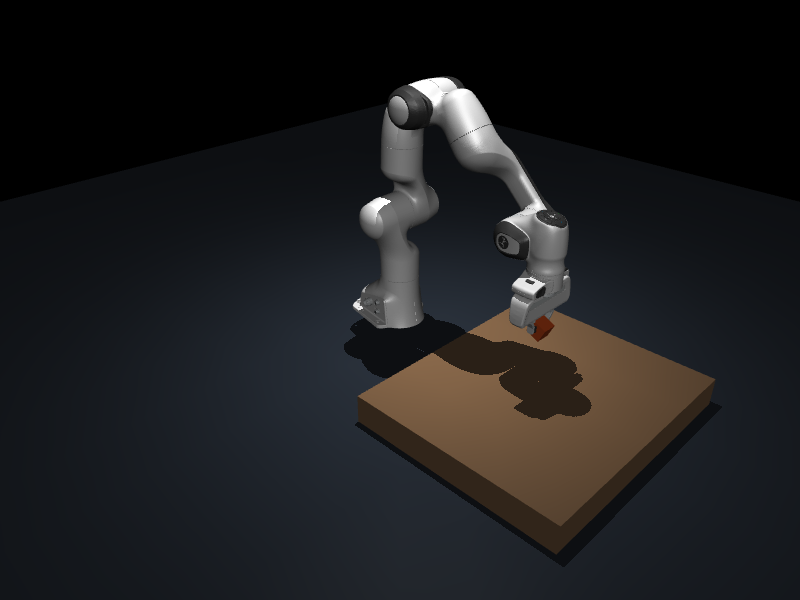

# EE5110-SegC — 第一阶段抓取系统

GitHub：[m13961023616-pixel/EE5110-SegC](https://github.com/m13961023616-pixel/EE5110-SegC)。

当前版本：MuJoCo + Franka Panda + 单个 4 cm cube。Python 3.12。

这是可运行的开发起点，**尚未完成课程要求的公开 3D 数据集 baseline**。
当前先验证 oracle perception 下的 manipulation backbone：

```text
重置场景 → 读取真实物体位姿 → 生成 top grasp → IK
→ 检查路径碰撞 → 执行 approach → 物理闭爪 → lift
→ 持续检查物体高度和双侧接触 → 保存实验结果
```

## 在 PyCharm 中开始

1. 打开项目目录 `F:\NUS\Semester I\EE5110\Segment C\CA`。
2. Settings → Project → Python Interpreter → Add Interpreter → Existing environment。
3. 选择项目目录中的 `.venv\Scripts\python.exe`。
4. 打开 `main.py`，直接 Run。默认打开 MuJoCo 窗口，完成一次固定 cube 抓取。
5. 如希望完成后保留窗口，在 Run Configuration 的 Parameters 填入 `--keep-open`。
6. Working directory 设置为本项目 CA 目录；运行输出保存在 `outputs/`。

项目路径包含空格，在 PowerShell 使用绝对可执行文件路径时，前面加 `&`。
以下命令在 PyCharm Terminal 的 CA 目录执行：

```powershell
# 一次可视化抓取，并保留窗口
.\.venv\Scripts\python.exe main.py --keep-open

# 10 次随机位置/朝向，无界面运行
.\.venv\Scripts\python.exe main.py --headless --randomize --trials 10 --seed 42

# 一次固定抓取，保存最终场景 PNG
.\.venv\Scripts\python.exe main.py --headless --snapshot

# 失败检测与 reset 回归检查
.\.venv\Scripts\python.exe tests\test_baseline.py
```

直接 Run 默认按物理时间显示动作；`--fast` 取消 GUI 中的实时等待。
`--headless` 总是不做实时等待，但仍使用同样的物理步长。
`--randomize` 随机 x、y 和 yaw；不指定时始终是固定姿态。
`--trials N` 控制次数，`--seed` 控制 NumPy 随机序列。
GUI 的关闭操作会中断运行并保留已经完成的 trial 日志。

## 环境和模型

本机已经建立 `.venv`，安装 MuJoCo 3.15.0、NumPy 2.5.3。
`requirements.txt` 固定本次验证的两个直接依赖版本。
没有修改系统 Python 的包环境。模型已经下载到 `assets/panda/`。

若需重建：

```powershell
python -m venv .venv
.\.venv\Scripts\python.exe -m pip install -r requirements.txt
.\.venv\Scripts\python.exe scripts\setup_assets.py
```

模型使用 Google DeepMind MuJoCo Menagerie 的 Franka Emika Panda。
原始 XML、网格、README、许可证保持在模型目录中；自定义场景在内存中生成。
`assets/panda/manifest.json` 记录下载的 commit 和每个文件的 SHA-256；
重新运行准备脚本会校验文件完整性，已有 manifest 时使用相同 commit。
仓库中的 `assets/panda.lock.json` 固定模型 commit 和 SHA-256，克隆后使用同一版本。
只有在没有锁定信息和本地 manifest 的新目录中才会解析上游 main commit。

- [MuJoCo Python 接口](https://mujoco.readthedocs.io/en/latest/python.html)
- [Panda 模型及许可](https://github.com/google-deepmind/mujoco_menagerie/tree/main/franka_emika_panda)

## 代码阅读顺序

| 文件 | 职责 | 建议观察内容 |
| --- | --- | --- |
| `main.py` | 组织一次 trial 和多次实验 | `trial()` 中各阶段、异常和结果 |
| `robot_manipulation/config.py` | 集中配置参数 | 尺寸、工作区、高度阈值、速度限制 |
| `robot_manipulation/environment.py` | 构建和重置物理场景 | robot/object ID、`reset()`、接触信息 |
| `robot_manipulation/perception.py` | 从仿真读取物体状态 | `ObjectState`；当前没有相机 |
| `robot_manipulation/transforms.py` | 坐标变换和 SO(3) 误差 | `T_A_B` 的定义和米制单位 |
| `robot_manipulation/grasp.py` | 规则 top grasp | pregrasp、grasp、lift 的 4×4 pose |
| `robot_manipulation/planning.py` | IK 和路径检查 | `ik()` 与 `plan()` 是不同步骤 |
| `robot_manipulation/control.py` | 执行轨迹、夹爪控制 | `data.ctrl`；执行时不设置物体位置 |
| `robot_manipulation/evaluation.py` | 成功判定、实验记录 | 高度保持和双侧接触比例 |

PyCharm 可先在 `trial()`、`Planner.ik()`、`Controller.execute()` 设置断点。
查看物体 pose、目标 pose、joint configuration 和 `failure_stage`。
调试时先用固定 cube；随机实验用于稳定性统计。

## 坐标和物理约定

- 米、秒、弧度；世界 +z 向上，机器人 base 与 world 对齐。
- `T_A_B` 是 B 坐标系在 A 中的 pose，将 B 中的点变换到 A。
- 抓取 frame 的 +z 指向下方，+y 是夹爪闭合方向。
- `grasp_site` 位于 Panda 指尖接触垫中心，在 hand frame 的 z=0.1034 m。
- cube 平放，仅随机 x/y/yaw；夹爪对称性允许 yaw 相差 pi 的等效抓取。
- 桌面高度为 0 m，Panda base 位于同一高度；此为简化工作台布局。
- 物体 0.05 kg；夹爪接触摩擦系数 1.5，cube 为 1.2。当前值偏有利于抓取，后续需要扫描。
- reset 可以设置初始 qpos；**执行时只使用关节/夹爪 actuator 命令**。
  未用 weld、粘附约束或物体位置瞬移实现抓取。
- lift 路径检查中的 attached-object pose 是 scratch 数据上的碰撞预测。
  它不会改变真实仿真物体，实际 lift 仍由摩擦接触决定。

## 规划器范围

IK 采用 MuJoCo Jacobian + 阻尼最小二乘，检查位置和旋转误差以及关节范围。
IK 在 scratch `MjData` 上运算，不移动正在运行的机器人。

当前场景无障碍物，规划采用 home→pregrasp 的关节插值，以及 approach/lift 的笛卡尔路点。
通过关节空间采样检查整条候选路径，再用 cubic smoothstep 生成命令。
名义关节速度上限为 0.5 rad/s，名义加速度上限为 2 rad/s²。
执行阶段继续检查非预期接触和最终位姿误差。

这是结构化基线规划器，**不是 RRT/MoveIt，也不会绕过障碍物**。
采样碰撞检查不是连续碰撞保证；没有完整的力矩、载荷和接触动力学规划。
加入 clutter 时，需要替换或扩展路径搜索与候选 grasp 过滤，不能直接沿用当前路径。

## 成功判定与日志

闭爪后先要求两个 finger body 都接触 cube。lift 后保持 1 秒：

1. 整个保持期间物体中心高度均超过初始高度 + 0.08 m。
2. 至少 95% 的物理采样步中两个夹爪都接触物体。

两个条件同时满足才是 SUCCESS。成功指抓取并抬升，当前不执行 place。

每次运行生成带时间戳的两个文件，不覆盖旧实验：

- `outputs/trials_*.jsonl`：一行一个 trial；spawn/grasp pose、成功状态、失败阶段、时间和高度等。
- `outputs/summary_*.json`：成功率、失败统计、seed、配置、依赖版本和机器人模型 commit。
- `--snapshot` 额外保存最终场景 PNG，需要本机 OpenGL 支持；保存失败会给出提示。

失败阶段包括 `SPAWN_FAIL`、`GRASP_GENERATION_FAIL`、`IK_FAIL`、`PLANNING_FAIL`、
`COLLISION_FAIL`、`EXECUTION_FAIL`、`GRASP_FAIL`、`SLIP_FAIL`。
预期的 trial 失败会记录原因并继续下一次 reset；启动配置/模型错误直接报错。
全部 trial 成功时程序退出码为 0；任一失败为 1；中断为 130。

## 当前验收与下一阶段

第一阶段已完成：场景、机器人、oracle pose、top grasp、IK、路径检查、物理抓取、lift 判定和日志。
最终检查包含 seed=42 的 10 次随机 cube trial 和 4 个失败检测/reset 回归检查。
具体结果与限制见 `PROGRESS.md`；10 次同类 cube 成功不能推导为一般物体成功率。
精选实验日志和汇总保存在 `docs/validation/v0.1.0/`。



下一阶段首先加入公开 3D 物体数据集：随机选择和加载物体，处理尺寸、质量、碰撞网格，
生成多个候选抓取，再评估多物体结果和失败分布。之后确定一个有技术深度的挑战，
设计改进和对照实验。RGB-D/估计感知、place、clutter、失败恢复尚未实现。

## 外接硬盘权限

本次通过获准的操作在 F 盘创建文件和运行仿真。
这不说明该盘已经支持 Windows 沙盒的全部保护能力；应用之前仍给出不支持沙盒控制的提示。
后续 Codex 命令可能继续需要额外授权。PyCharm 应直接使用本项目 `.venv` 解释器。

开发与版本控制流程见 `CONTRIBUTING.md`，阶段记录见 `CHANGELOG.md`。
